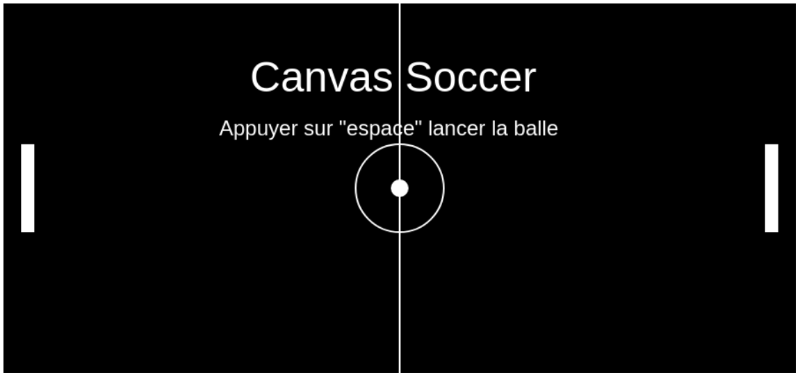

# CanvasSoccer V1.2

V1.2 :
  - Choix d'un drapeau pour représenter chaque joueur

V1.1 : 
  - Possiblité de bouger les paddles pour la remise en jeux après un but 
  - Intégration du jeux canvas dans react

V1 : Création d'un petit jeu à la Pong en vailla JS pour tester la balise <canvas>

  

---
*Démarrer la page `/public/index.html` dans un navigateur internet*

## Next Feature

Road to V2

    - Intégrer l'appli en canvas dans un template react pour créer un 
      page simple.

    - Ajouter un mod de jeux "petit but" sélectionable avec un bouton
      sur l'interface, possiblité de reset du jeux en cliquant sur le
      bouton correspondant au jeux.
    
    - Sélection d'avatar de drapeaux de pays pour les 2 joueurs situé
      sur le côté du canvas

    - Mise en ligne de l'appli
